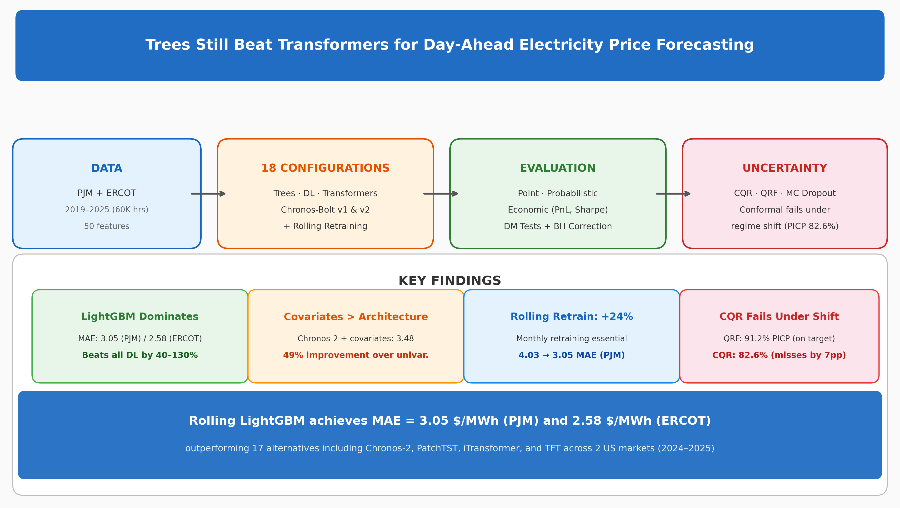
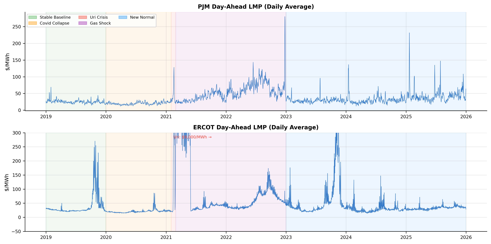

# 🌲 Trees Still Beat Transformers for Day-Ahead Electricity Price Forecasting

[](https://python.org)
[](LICENSE)
[](https://www.journals.elsevier.com/applied-energy)
[](#3-model-suite-18-configurations)
[](#2-dataset)

> **Applied Energy (2026) — Under Review**
>
> An 18-configuration benchmark of gradient-boosted trees, deep learning architectures, and time-series foundation models for day-ahead electricity price forecasting across PJM and ERCOT (2019–2025), with conformal prediction, expanding-window retraining, and realistic economic simulation.

<p align="center">
  
</p>

---

## 📋 Table of Contents

| Section | Description |
|---------|-------------|
| [1. Research Overview](#1-research-overview) | Motivation, contributions, and research questions |
| [2. Dataset](#2-dataset) | Markets, features, splits, and volatility regimes |
| [3. Model Suite](#3-model-suite-18-configurations) | All 18 configurations across 5 model families |
| [4. Repository Structure](#4-repository-structure) | Complete file tree |
| [5. Quick Start](#5-quick-start) | Installation, pre-flight, and execution |
| [6. Pipeline Reference](#6-pipeline-reference) | Step-by-step with GPU requirements and timings |
| [7. Evaluation Framework](#7-evaluation-framework) | Point, probabilistic, and economic metrics |
| [8. Results Summary](#8-results-summary) | Key tables and findings |
| [9. Requirements](#9-requirements) | Dependencies |
| [10. Citation](#10-citation) | BibTeX and key references |

---

## 1. Research Overview

### Motivation

US electricity markets have experienced unprecedented volatility since 2020 — COVID demand collapse, Winter Storm Uri (\$9,000/MWh), the 2022 gas crisis, and an accelerating renewables transition. Yet existing EPF benchmarks predominantly use **pre-2020 European data** and evaluate **only point accuracy**. This work addresses three critical gaps simultaneously:

- **Recency:** Post-pandemic US market data (2019–2025)
- **Breadth:** 18 model configurations including foundation models (Chronos v1 & v2)
- **Depth:** Point + probabilistic + economic evaluation with statistical rigor

### Key Contributions

| # | Contribution | Key Result |
|---|-------------|------------|
| 1 | **Largest US EPF benchmark** — 18 configs, 16 families, 2 markets, 7 years | Rolling LightGBM: MAE 3.05 (PJM), 2.58 (ERCOT) |
| 2 | **Expanding-window protocol** — 24 monthly retraining windows | **24.1% MAE improvement** over static training |
| 3 | **Three probabilistic paradigms** — CQR, QRF, MC Dropout | CQR fails at 82.6% vs 90% target (regime shift) |
| 4 | **Foundation model evaluation** — Chronos v1, v2, v2+covariates | Covariates cut MAE by **49%**, still trail LGBM by 14% |
| 5 | **Economic simulation** — PnL with transaction costs and slippage | MAE ≠ PnL when risk-aware filters are applied |

### Research Questions

| RQ | Question | Primary Metric |
|----|----------|----------------|
| RQ1 | Which model family achieves best point accuracy? | MAE, DM test |
| RQ2 | Which probabilistic method achieves best calibration? | PICP, CRPS |
| RQ3 | Does better forecasting translate to economic utility? | Sharpe ratio, PnL |
| RQ4 | Do PJM-trained models generalize to ERCOT? | MAE degradation |

---

## 2. Dataset

### Markets

| Market | Product | Node | Period | Hourly Obs |
|--------|---------|------|--------|------------|
| **PJM** | Day-Ahead LMP | WESTERN HUB | 2019–2025 | ~59,600 |
| **ERCOT** | Day-Ahead SPP | HB_HOUSTON | 2019–2025 | ~59,600 |

### Exogenous Features (~50 engineered)

| Source | Features |
|--------|----------|
| **EIA API v2** | Solar %, Wind MW, Gas MW, Nuclear MW, Net Load, Demand |
| **Open-Meteo** | Temperature, Wind Speed, Humidity, Solar Radiation (5 cities/market) |
| **EIA Henry Hub** | Natural gas spot price ($/MMBtu) |
| **Computed** | Hour/DOW/Month sin-cos, US holidays, lag features (1h–168h) |

### Chronological 4-Way Split (no data leakage)

```
2019-01-01 ── 2021-12-31 │ 2022-01-01 ── 2022-12-31 │ 2023-01-01 ── 2023-12-31 │ 2024-01-01 ── 2025-12-31
       TRAIN (25,548h)           CALIBRATION (CQR)            VALIDATION              TEST (17,040h)
    [base model training]     [conformal calibration]     [hyperparameter tuning]     [final evaluation]
```

> **Strict protocol:** MinMaxScaler and KNNImputer are fit **only on TRAIN**, then applied to CAL/VAL/TEST without refitting. Zero overlap between splits.

### Volatility Regimes

| Regime | Period | Characteristic |
|--------|--------|----------------|
| Stable Baseline | 2019 | Pre-COVID normal operations |
| COVID Collapse | 2020–early 2021 | Demand crash, depressed prices |
| **Uri Crisis** | Feb 2021 | ERCOT $9,000/MWh price cap hit |
| Gas Shock | 2021–2022 | Sustained high-price volatility |
| New Normal | 2023–2025 | High renewables, new volatility structure |

---

## 3. Model Suite (18 Configurations)

### Statistical Baselines (3)

| Model | Key Detail |
|-------|------------|
| Seasonal Naïve | 168h (weekly) seasonal persistence |
| AutoARIMA | `statsforecast`, hourly seasonality |
| MSTL + AutoETS | Multi-Seasonal Trend decomposition |

### Tree-Based (3)

| Model | Key Detail |
|-------|------------|
| **LightGBM** | MAE-optimized point + 7 quantile models |
| XGBoost | Point forecast baseline |
| Quantile Regression Forest | Non-parametric probabilistic intervals |

### Deep Learning (6)

| Model | Architecture | Source |
|-------|-------------|--------|
| Bayesian Bi-LSTM | Bidirectional LSTM + MC Dropout | TensorFlow |
| PatchTST | Patch-based Transformer | ICLR 2023 |
| iTransformer | Inverted attention across variables | ICLR 2024 |
| N-HiTS | Hierarchical interpolation | AAAI 2023 |
| BiTCN | Bidirectional Temporal CNN | neuralforecast |
| TFT | Temporal Fusion Transformer | neuralforecast |

### Foundation Models (2 + 1 covariate-enhanced)

| Model | Type | Detail |
|-------|------|--------|
| Chronos-Bolt (v1) | Zero-shot | Amazon, univariate, no fine-tuning |
| Chronos-Bolt-Base (v2) | Zero-shot | Updated architecture, univariate |
| Chronos-Base + Covariates | Enhanced | v2 with top-5 SHAP features via Ridge residuals |

### Ensemble & Rolling (4)

| Model | Detail |
|-------|--------|
| Stacked Ensemble | LightGBM meta-learner on {LightGBM + XGBoost + BiLSTM} |
| Rolling LightGBM | 24-month expanding-window retraining |
| Rolling XGBoost | 24-month expanding-window retraining |

---

## 4. Repository Structure

```
V2/
├── config.py                          # Paths, hyperparameters, split dates
├── utils.py                           # Shared metrics, DM test, data loading
├── requirements.txt                   # Pinned dependencies
├── smoke_test.py                      # Pre-flight validation
├── test_data_integrity.py             # Data leakage assertion tests
├── run_all.sh                         # Full pipeline orchestration
├── generate_graphical_abstract.py     # Advanced graphical abstract generator
│
├── data/
│   ├── raw/                           # Downloaded parquets
│   └── processed/                     # 8 train/cal/val/test parquets
│
├── step_00_download_*.py (×4)         # PJM, ERCOT, weather, EIA data
├── step_01_preprocess.py              # Merge, clean, feature-engineer, split
├── step_01_eda.py                     # Exploratory data analysis
├── step_02_train_baselines.py         # Seasonal Naïve, AutoARIMA, MSTL
├── step_03_train_lgbm.py              # LightGBM (point + 7 quantiles)
├── step_04_train_xgboost.py           # XGBoost
├── step_05_train_bilstm.py            # Bayesian Bi-LSTM + MC Dropout
├── step_06_train_patchtst.py          # PatchTST
├── step_06b_train_bitcn.py            # BiTCN
├── step_07_train_itransformer.py      # iTransformer
├── step_07b_train_tft.py              # TFT
├── step_08_train_nhits.py             # N-HiTS (point)
├── step_08b_nhits_quantile.py         # N-HiTS (quantile)
├── step_09_chronos_inference.py       # Chronos-Bolt v1 zero-shot
├── step_09b_chronos2_inference.py     # Chronos v2 + covariate-enhanced
├── step_09_evaluate.py                # All metrics: point + prob + economic
├── step_10_conformal.py               # CQR on calibration set (2022)
├── step_10b_alpha_sweep.py            # Conformal alpha sweep
├── step_11_qrf.py                     # Quantile Regression Forest
├── step_12_ensemble.py                # Stacked ensemble meta-learner
├── step_14_dm_tests.py                # Diebold-Mariano + BH FDR
├── step_15_ablation.py                # Lag, feature, dropout, ensemble ablation
├── step_16_stress_test.py             # OOS regime evaluation
├── step_17_figures.py                 # Publication figures (300 DPI)
├── step_17b_novelty_figures.py        # SHAP, CQR vs QRF, PnL, error figures
├── step_18_paper_tables.py            # LaTeX tables
├── step_19_rq4_crossmarket.py         # PJM → ERCOT transfer
├── step_20_fix_weaknesses.py          # BiTCN, TFT, coverage robustness
├── step_21_rolling_window.py          # 24-month expanding-window retraining
├── step_22_integrate_new_results.py   # Consolidate results into tables
├── step_23_final_updates.py           # DM test updates + final tables
│
├── models/                            # Trained model artifacts (.joblib, .keras)
├── reports/
│   ├── figures/                       # 31 publication-quality figures
│   ├── tex/                           # Generated LaTeX table fragments
│   ├── table_*.csv                    # All result tables
│   └── *_preds_*.csv                  # Model predictions
│
└── paper/
    ├── main.tex                       # Manuscript (Elsevier elsarticle)
    ├── cover_letter.tex               # Submission cover letter
    ├── highlights.tex                 # Elsevier highlights (5 bullets)
    ├── references.bib                 # 22 BibTeX entries
    └── sections/                      # Modular LaTeX sections
        ├── introduction.tex
        ├── literature.tex
        ├── methodology.tex
        ├── results.tex
        ├── conclusion.tex
        └── appendix.tex
```

> **Note:** QRF models (~200MB each) exceed GitHub's 100MB limit and are excluded. Regenerate with `python step_11_qrf.py`.

---

## 5. Quick Start

### Prerequisites

- Python 3.10–3.12
- NVIDIA GPU recommended (GTX 1650+ / 4GB+ VRAM for DL steps)
- API keys: [EIA](https://www.eia.gov/opendata/), [PJM Data Miner](https://dataminer2.pjm.com/)

### Installation

```bash
git clone https://github.com/MufakirAnsari/Energy-Cost-Prediction.git
cd Energy-Cost-Prediction

python -m venv .venv
source .venv/bin/activate

pip install -r requirements.txt
pip install tf-keras   # Required for tensorflow-probability
```

### Pre-flight Check

```bash
python smoke_test.py
```

### Run the Full Pipeline

```bash
# Step 1: Download data (one-time, ~30 min)
python step_00_download_pjm.py
python step_00_download_ercot.py
python step_00_download_eia.py
python step_00_download_weather.py

# Step 2: Preprocess + EDA
python step_01_preprocess.py
python step_01_eda.py

# Step 3: Full automated pipeline
chmod +x run_all.sh
./run_all.sh 2>&1 | tee logs/pipeline_$(date +%Y%m%d_%H%M).log
```

> `run_all.sh` is **idempotent** — existing outputs are skipped. Safe to re-run after interruptions.

---

## 6. Pipeline Reference

| Step | Script | GPU | Time |
|------|--------|-----|------|
| 00 | `step_00_download_*.py` (×4) | ✗ | ~30 min |
| 01 | `step_01_preprocess.py` | ✗ | ~5 min |
| 01b | `step_01_eda.py` | ✗ | ~2 min |
| 02 | `step_02_train_baselines.py` | ✗ | ~4–5 hrs |
| 03 | `step_03_train_lgbm.py` | ✗ | ~5 min |
| 04 | `step_04_train_xgboost.py` | ✗ | ~5 min |
| 05 | `step_05_train_bilstm.py` | ✅ | ~30–45 min |
| 06 | `step_06_train_patchtst.py` | ✅ | ~45–60 min |
| 06b | `step_06b_train_bitcn.py` | ✅ | ~30 min |
| 07 | `step_07_train_itransformer.py` | ✅ | ~30–45 min |
| 07b | `step_07b_train_tft.py` | ✅ | ~45 min |
| 08 | `step_08_train_nhits.py` | ✅ | ~20–30 min |
| 08b | `step_08b_nhits_quantile.py` | ✅ | ~20 min |
| 09 | `step_09_chronos_inference.py` | ✗ | ~3–5 hrs |
| 09b | `step_09b_chronos2_inference.py` | ✅ | ~1–2 hrs |
| 10 | `step_10_conformal.py` | ✗ | ~2 min |
| 11 | `step_11_qrf.py` | ✗ | ~10 min |
| 12 | `step_12_ensemble.py` | ✗ | ~5 min |
| 13 | `step_09_evaluate.py` | ✗ | ~5 min |
| 14 | `step_14_dm_tests.py` | ✗ | ~3 min |
| 15 | `step_15_ablation.py` | ✗ | ~20 min |
| 16 | `step_16_stress_test.py` | ✗ | ~5 min |
| 17 | `step_17_figures.py` + `step_17b_novelty_figures.py` | ✗ | ~3 min |
| 18 | `step_18_paper_tables.py` | ✗ | ~2 min |
| 19 | `step_19_rq4_crossmarket.py` | ✗ | ~5 min |
| 20 | `step_20_fix_weaknesses.py` | ✅ | ~1 hr |
| 21 | `step_21_rolling_window.py` | ✗ | ~40 min |
| 22 | `step_22_integrate_new_results.py` | ✗ | ~2 min |
| 23 | `step_23_final_updates.py` | ✗ | ~1 min |

**Total estimated time:** ~15–18 hours (GPU) · ~24+ hours (CPU only)

---

## 7. Evaluation Framework

### Point Accuracy (RQ1)

| Metric | Description |
|--------|-------------|
| **MAE** | Mean Absolute Error — primary metric, robust to spikes |
| **RMSE** | Root Mean Squared Error — penalizes large errors |
| **DM test** | Diebold-Mariano with HLN small-sample correction + BH FDR |

### Probabilistic Quality (RQ2)

| Metric | Description |
|--------|-------------|
| **PICP** | Prediction Interval Coverage Probability (target: ≥90%) |
| **MPIW** | Mean Prediction Interval Width (sharpness) |
| **CRPS** | Continuous Ranked Probability Score (proper scoring rule) |

### Economic Utility (RQ3)

```
Transaction cost: $0.50/MWh  ·  Volume: 1 MWh/trade  ·  Slippage: 0.3σ
Strategies: Seasonal Naïve · LightGBM · Risk-Aware CQR · Risk-Aware Bayesian · Oracle
Metrics: Total PnL · Sharpe · Sortino · Max Drawdown · Win Rate
```

---

## 8. Results Summary

> **All numbers below are from the final test set (2024–2025), strictly out-of-sample.**

### RQ1 — Point Accuracy (Test Set MAE, $/MWh)

| Model | MAE (PJM) | RMSE (PJM) | MAE (ERCOT) | RMSE (ERCOT) |
|-------|-----------|------------|-------------|--------------|
| **LightGBM (rolling)** | **3.05** | **6.40** | **2.58** | 6.50 |
| XGBoost (rolling) | 3.09 | 6.40 | 2.87 | 7.41 |
| Chronos-Base + Covariates | 3.48 | 6.65 | 5.58 | 14.92 |
| XGBoost (static) | 4.02 | 12.52 | 3.46 | 11.55 |
| LightGBM (static) | 4.03 | 12.32 | 3.39 | 10.64 |
| QRF | 4.55 | 12.29 | 3.68 | 9.88 |
| BiLSTM | 4.84 | 10.10 | 3.65 | 10.11 |
| Ensemble | 4.93 | 12.98 | 3.44 | 10.39 |
| PatchTST | 6.69 | 12.99 | 5.27 | 15.19 |
| N-HiTS | 6.75 | 12.96 | 5.06 | 13.81 |
| Chronos-Bolt-Base (v2) | 6.85 | 12.77 | 7.96 | 22.01 |
| Chronos-Bolt (v1) | 7.02 | 13.08 | 7.77 | 21.54 |
| iTransformer | 7.47 | 14.57 | 6.07 | 16.65 |
| TFT | 8.01 | 15.47 | 7.09 | 19.42 |
| BiTCN | 8.02 | 16.19 | 5.41 | 14.76 |
| AutoARIMA | 12.76 | 24.94 | 12.53 | 34.13 |
| MSTL | 14.40 | 24.95 | 11.16 | 24.03 |
| Seasonal Naïve | 14.45 | 29.21 | 11.59 | 30.60 |

### Expanding-Window Retraining

| Market | Model | Static MAE | Rolling MAE | Improvement |
|--------|-------|-----------|------------|-------------|
| PJM | LightGBM | 4.02 | 3.05 | **−24.1%** |
| PJM | XGBoost | 4.01 | 3.09 | **−22.9%** |
| ERCOT | LightGBM | 3.39 | 2.58 | **−23.7%** |
| ERCOT | XGBoost | 3.45 | 2.87 | **−17.0%** |

### RQ2 — Probabilistic Quality

| Method | PICP (PJM) | CRPS (PJM) | PICP (ERCOT) | CRPS (ERCOT) |
|--------|-----------|-----------|-------------|-------------|
| **QRF (90% CI)** | **91.17%** | 3.660 | **95.65%** | 3.238 |
| CQR (90% nominal) | 82.56% | 3.804 | 75.77% | 4.713 |
| LGBM Quantile (90% CI) | 69.70% | **3.349** | 75.77% | **2.776** |
| Chronos-Bolt (80% CI) | 73.63% | — | 80.80% | — |
| N-HiTS Quantile (80% CI) | 65.49% | 5.337 | 68.39% | 4.134 |
| BiLSTM MC Dropout (90% CI) | 57.09% | — | 64.37% | 2.904 |

> **QRF is the only method achieving ≥90% PICP** on both markets. CQR falls short due to exchangeability violation between the 2022 calibration set and 2024–2025 test period.

### RQ3 — Economic Utility

| Strategy | PnL (PJM) | Sharpe (PJM) | Win% (PJM) | PnL (ERCOT) | Sharpe (ERCOT) | Win% (ERCOT) |
|----------|----------|-------------|-----------|------------|---------------|-------------|
| Oracle | $31,602 | 19.45 | 100.0% | $29,555 | 11.02 | 100.0% |
| **LightGBM** | **$19,417** | **15.75** | **97.5%** | **$16,359** | **8.53** | **92.1%** |
| Seasonal Naïve | $13,660 | 10.06 | 81.0% | $860 | 0.69 | 49.9% |
| Risk-Aware CQR | $1,645 | 5.91 | 18.7% | $2,152 | 7.25 | 30.9% |
| Risk-Aware Bayesian | $881 | 5.29 | 14.3% | $500 | 2.85 | 14.6% |

### RQ4 — Cross-Market Transfer (PJM → ERCOT, zero-shot)

| Model | In-Market MAE | Cross-Market MAE | Degradation |
|-------|--------------|-----------------|-------------|
| LightGBM | 3.39 | 4.67 | +37.9% |
| XGBoost | 3.46 | 4.69 | +35.6% |
| QRF | 3.68 | 5.03 | +36.7% |

### Key Findings

1. **Trees dominate.** Rolling LightGBM achieves MAE 3.05 (PJM) and 2.58 (ERCOT), outperforming all DL models by 20–130% and all foundation models by 12–130%.
2. **Covariates > Architecture.** Adding covariates to Chronos-2 reduces MAE by 49%; the v1→v2 architectural upgrade yields only 2.3%.
3. **Monthly retraining is essential.** Expanding-window retraining provides a consistent 24% improvement across all 24 test months.
4. **CQR fails under regime shift.** Conformal prediction's exchangeability assumption is violated between 2022 calibration and 2024–2025 test, causing PICP to fall 7–14pp below target. QRF is robust without this assumption.
5. **Statistical accuracy ≠ economic value.** Risk-aware CQR captures only 8.5% of LightGBM's PnL due to overly wide intervals causing trade abstention.
6. **Cross-market transfer is viable but costly.** PJM→ERCOT zero-shot transfer incurs 36–38% MAE degradation.

---

## 9. Requirements

```
# Core                          # Deep Learning
pandas · numpy                  tensorflow · tensorflow-probability
scikit-learn · scipy            torch · neuralforecast

# Statistical                   # Foundation Model
statsforecast                   chronos-forecasting

# Tree-Based                    # Probabilistic
lightgbm · xgboost             mapie · properscoring · shap · arch
quantile-forest
                                # Visualization
                                matplotlib · seaborn
```

Full pinned versions → [`requirements.txt`](requirements.txt)

---

## 10. Citation

```bibtex
@article{ansari2026trees,
  title   = {Trees Still Beat Transformers for Day-Ahead Electricity
             Price Forecasting},
  author  = {Ansari, Mufakir Qamar and Ansari, Mudabir Qamar},
  journal = {Applied Energy},
  year    = {2026},
  note    = {Under review}
}
```

### Key References

| Paper | Venue |
|-------|-------|
| Lago et al. (2021). *Forecasting day-ahead electricity prices* | Applied Energy |
| Nie et al. (2023). *PatchTST* | ICLR 2023 |
| Liu et al. (2024). *iTransformer* | ICLR 2024 |
| Ansari et al. (2024). *Chronos: Learning the language of time series* | TMLR |
| Romano et al. (2019). *Conformalized Quantile Regression* | NeurIPS 2019 |
| Meinshausen (2006). *Quantile Regression Forests* | JMLR |
| Diebold & Mariano (1995). *Comparing Predictive Accuracy* | JBES |

---

<p align="center">
  
  <br><i>PJM and ERCOT day-ahead LMP with regime shading (2019–2025)</i>
</p>

<p align="center">
  <sub>© 2026 Mufakir Qamar Ansari & Mudabir Qamar Ansari · Wright State University & Lamar University</sub>
</p>
